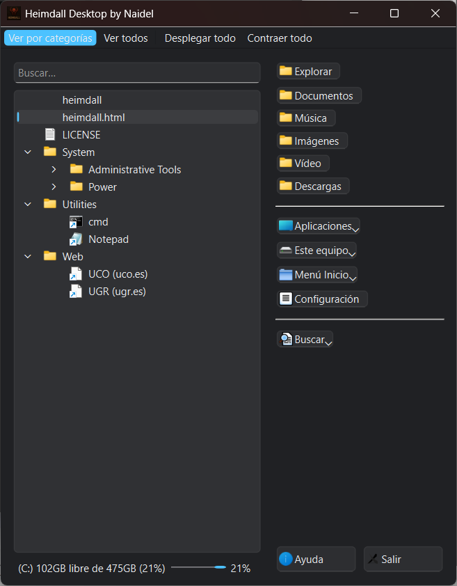
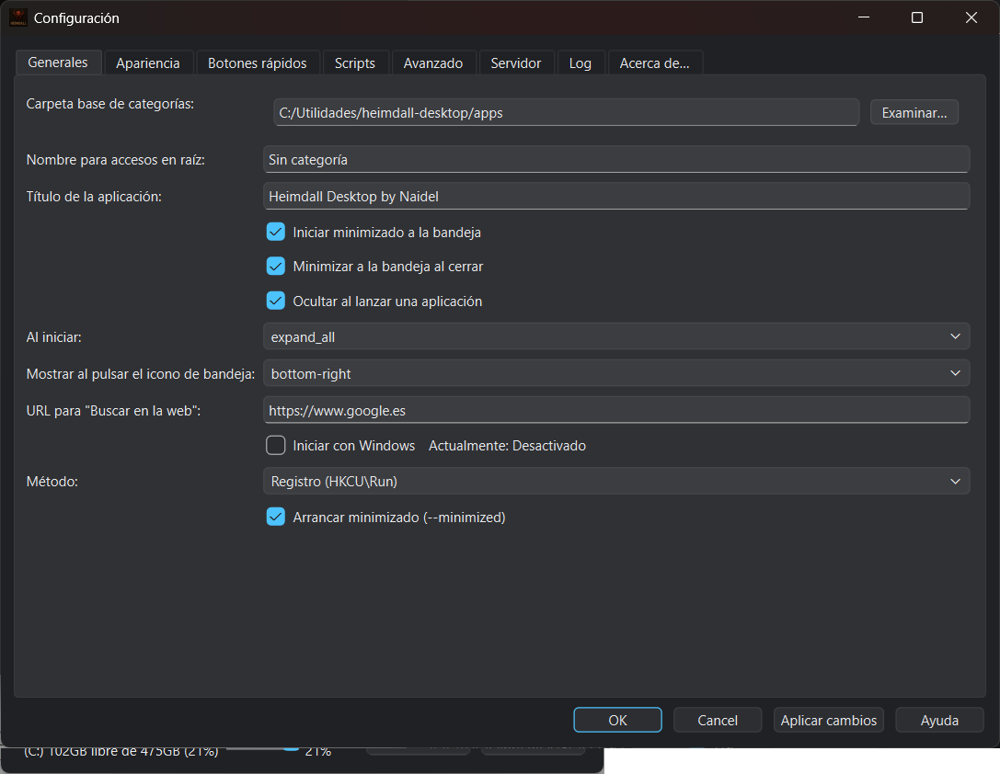
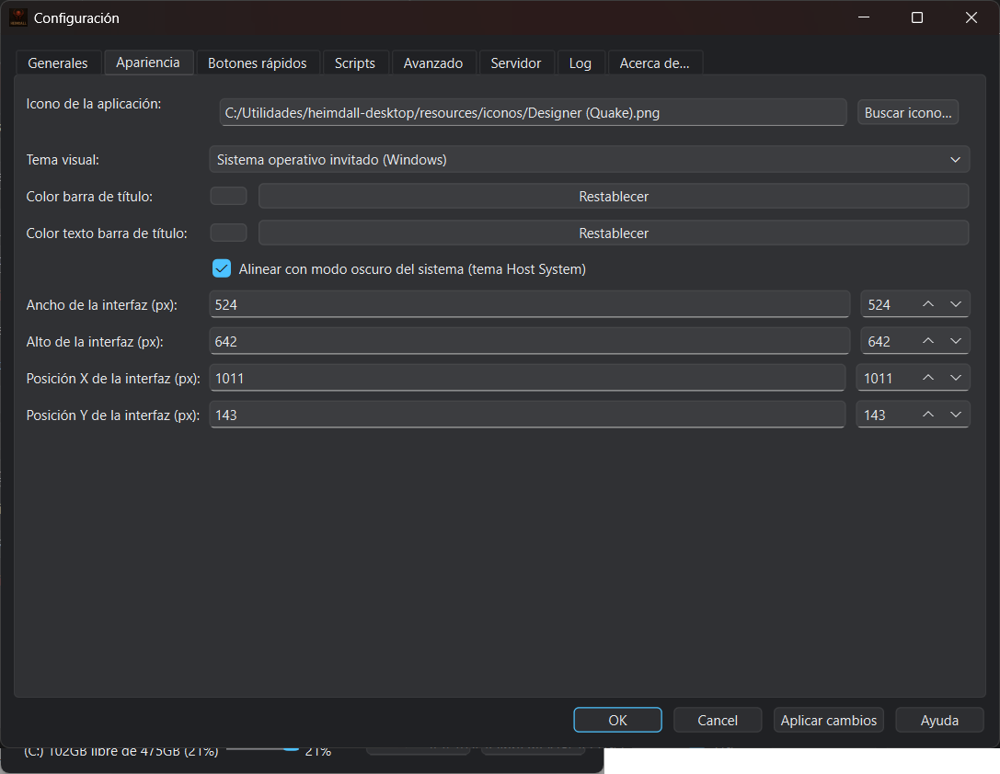
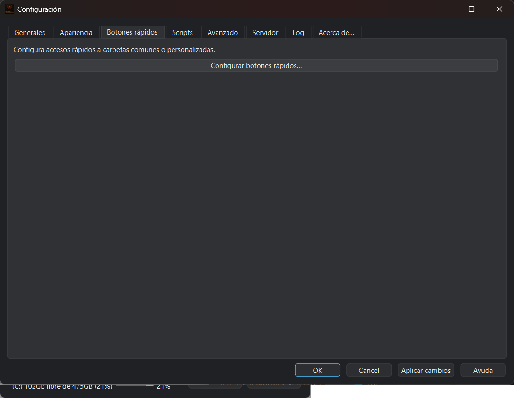
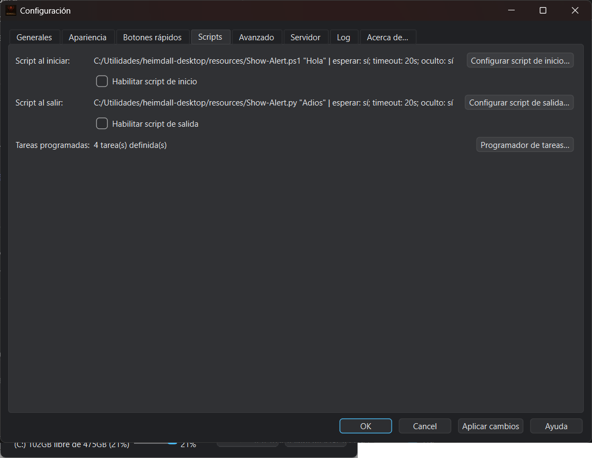
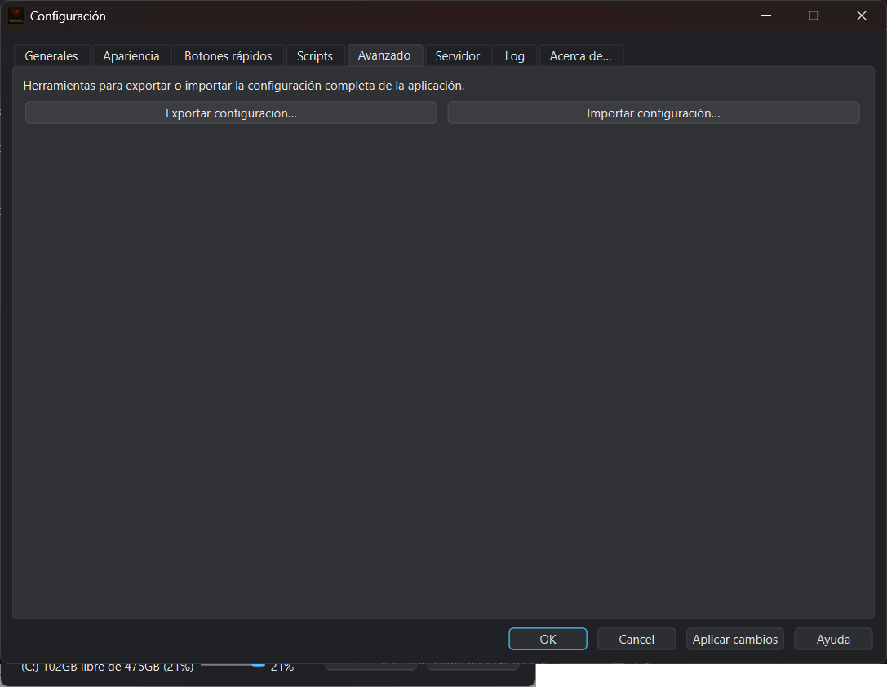
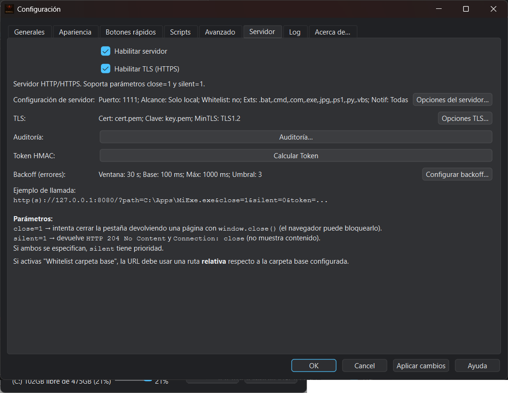
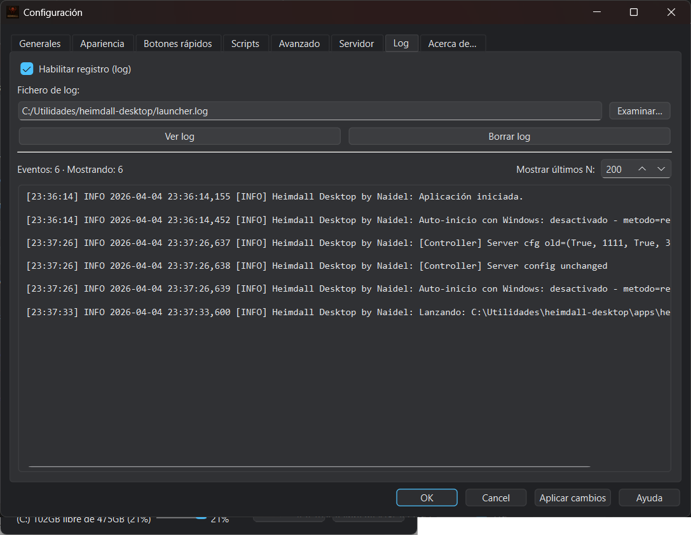
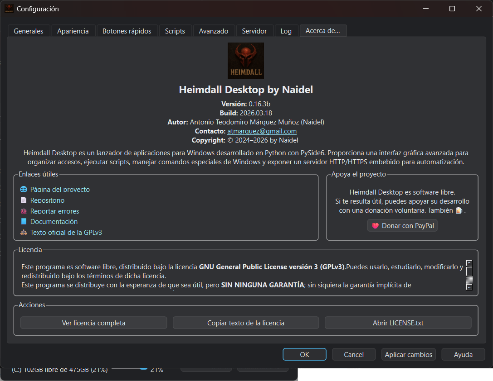

# Heimdall Desktop by Naidel


**Heimdall Desktop** is an advanced application launcher for Windows,
developed in **Python** using **PySide6**.

It provides a powerful and well‑organized graphical interface to:

- Manage shortcuts to applications, scripts, and special locations.
- Execute advanced Windows commands.
- Automate local or remote actions through an embedded HTTP/HTTPS server.

The project is aimed at **advanced users, technicians, and administrators**
who need a centralized control point without sacrificing flexibility or security.

---

## ✨ Key Features

- Modern graphical user interface based on **PySide6** (Qt).
- Flexible shortcut organization:
  - Folder‑based (real filesystem structure).
  - Optional flat view.
- Creation and management of:
  - Windows shortcuts (`.lnk`).
  - Web shortcuts (`.url`).
- **Configurable quick buttons** for frequent folders and actions.
- Execution of:
  - Startup scripts (pre‑launch).
  - Exit scripts (post‑shutdown).
  - Scheduled tasks.
- **Integration with the Windows Start Menu**.
- Extensible catalog of **special Windows commands**:
  - `shell:`
  - `ms-settings:`
  - `.msc`
  - CLSID / GUID.
- **Integrated HTTP / HTTPS server** for automation:
  - TLS support.
  - Token‑based authentication.
  - Path and extension whitelist.
  - Action auditing.
  - Backoff and error‑rate limiting.
- Configurable Windows auto‑startup.
- Advanced **logging system** with integrated viewer.

---

## 🖥️ Requirements

- **Windows 10 / Windows 11**
- **Python 3.10 or later** (only required when running from source)

---

## 🚀 Getting Started

### Running the application

Heimdall Desktop can be launched in two ways:

- **From source code**:

```bash
python main.py
```

- **Using the packaged executable** (`.exe`).

---

### Recommended initial configuration

1. Configure the **base shortcuts folder** in:
   > Configuration → General

2. Configure server options if automation is required:
   > Configuration → Server  
   (port, local scope, TLS, token, etc.)

3. Create shortcuts and web links inside the configured base folder.

---

### Example HTTP server usage

Test the integrated server using a URL such as:

```text
http://127.0.0.1:8080/?path=MyFolder\MyApp.exe&close=1
```

- If **token authentication** is enabled:
  - add the `token=...` parameter, or
  - use the HTTP header `X-Launcher-Token`.

---

## 🖼️ Screenshots

The following screenshots illustrate the interface and main configuration panels of **Heimdall Desktop**.
All images are stored under `docs/images/`.

---

### 🪟 Main window

Main application view in **category mode**, showing:

- Filesystem‑based shortcut tree.
- Expandable/collapsible hierarchy.
- Integrated search.
- Quick buttons panel on the right.



---

### ⚙️ Options · General

Configuration → General tab, where the core application settings are defined:

- Base shortcuts folder.
- Execution behavior.
- Automatic Windows startup.
- General launcher options.



---

### 🎨 Options · Appearance

Configuration → Appearance tab, focused on visual customization:

- Light, dark, or system theme.
- Application icon.
- Initial window size and position.
- Visual integration with Windows 10 / 11.



---

### ⚡ Options · Quick Buttons

Configuration → Quick Buttons tab, allowing permanent shortcuts:

- Buttons for frequently used folders (Documents, Downloads, etc.).
- User‑defined custom shortcuts.
- Name, path, and icon customization.



---

### 🧩 Options · Scripts and Tasks

Configuration → Scripts tab, oriented toward automation:

- Startup scripts (pre‑launch).
- Exit scripts (post‑shutdown).
- Task scheduler configuration.
- Execution parameters, wait mode, and timeout.



---

### 🧪 Options · Advanced

Configuration → Advanced tab, focused on maintenance and portability:

- Full configuration export to JSON.
- Import of previous configurations.
- Internal application state management.



---

### 🌐 Options · HTTP / HTTPS Server

Configuration → Server tab, for the embedded automation server:

- Server enable/disable.
- Port and scope (local or network).
- TLS certificate support.
- Path whitelist.
- Allowed extensions control.
- Token‑based authentication.
- Backoff and error limiting.



---

### 🧾 Options · Auditing and Logs

Configuration → Log tab, showing internal activity:

- Execution records.
- Errors and relevant events.
- Server request auditing.
- Log cleaning and inspection.



---

### ℹ️ Options · About

Configuration → About tab, containing institutional information:

- Project details.
- Version and build.
- GPLv3 license.
- Useful links.
- Access to documentation and help.



---

## 📘 Documentation

Complete project documentation can be found in the `docs/` directory:

- **Architecture**  
  `docs/ARCHITECTURE.md`
- **Detailed configuration**  
  `docs/CONFIGURATION.md`
- **HTTP/HTTPS server API**  
  `docs/HTTP_API.md`
- **Security notes**  
  `docs/SECURITY_NOTES.md`
- **Code conventions and comments**  
  `docs/CODE_COMMENTS.md`
- **Change log**  
  `docs/CHANGELOG.md`

---

## 🧾 Docstrings and Comments

The main entry file (`main.py`) includes **Spanish docstrings** following the
**Google‑style** convention, intended to facilitate:

- Code readability.
- Maintenance.
- Future extension of the project.

They should be used as a baseline reference when adding new modules.

---

## ⚖️ License

This project is distributed under the:

**GNU General Public License version 3 (GPLv3)**

See the `LICENSE` file for legal details.

---

## 🟢 Project Status

- Active project.
- Modular architecture.
- Designed for future extensions
  (new shortcut types, integrations, advanced automation).

---

## 👤 Author

Antonio Teodomiro Márquez Muñoz (Naidel)
